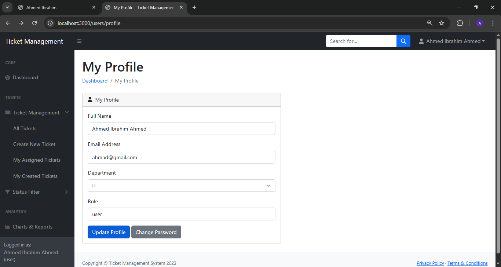

# Ticket Management System

A comprehensive ticket management system built with Node.js, Express, and SQLite. This application allows organizations to track and manage support tickets, assign them to team members, and monitor their status from open to resolved.

## Features

- **User Authentication**: Secure login and registration system with role-based access control
- **Ticket Management**: Create, view, update, and delete support tickets
- **Ticket Assignment**: Assign tickets to specific team members
- **Priority Levels**: Set and filter tickets by priority (high, medium, low)
- **Status Tracking**: Track ticket status (open, in progress, resolved, closed)
- **Commenting System**: Add comments to tickets for team collaboration
- **Dashboard**: Overview of ticket statistics and recent activities
- **Reporting**: Visual charts and statistics on ticket data
- **User Management**: Admin panel for managing users and their permissions

## Screenshots

Here are some screenshots of the application:

- **Login Screen**: 
- **Dashboard**: 
- **New Ticket**: 
- **Reports**: 
- **Profile**: 
- **Sweetalert**: 

## Tech Stack

- **Backend**: Node.js, Express.js
- **Database**: SQLite
- **Template Engine**: EJS
- **Authentication**: Session-based with bcrypt password hashing
- **UI Framework**: Bootstrap 5
- **Charts**: Chart.js

## Installation

1. Clone the repository
   ```
   git clone https://github.com/yourusername/ticket-management-system.git
   cd ticket-management-system
   ```

2. Install dependencies
   ```
   npm install
   ```

3. Seed the database with sample data
   ```
   npm run seed
   ```

4. Start the server
   ```
   npm start
   ```

5. For development with auto-restart
   ```
   npm run dev
   ```

6. Access the application at http://localhost:3000

## Default Login Credentials

### Admin User
- Email: admin@example.com
- Password: admin123

### Regular User
- Email: john@example.com
- Password: user123

## Project Structure

```
ticket-management-system/
├── config/             # Configuration files
├── controllers/        # Route controllers
├── middleware/         # Express middleware
├── models/             # Database models
├── public/             # Static files (css, js, images)
├── routes/             # Express routes
├── views/              # EJS templates
├── data/               # SQLite database files
├── server.js           # Express application
├── seed.js             # Database seeding script
└── package.json        # Project dependencies
```

## License

This project is licensed under the MIT License - see the LICENSE file for details. 